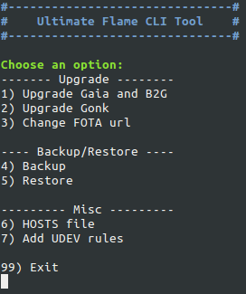

# Ultimate Flame CLI Tool

##Features

- update both Gaia and Gecko
- update Gonk from the base image
- switch to `nightly-latest` FOTA channel
- backup your data (Wifi, SMS, Contacts, sdcard, etc)
- restore your data (you will be logged out of most apps)
- patch HOSTS file to block ads
- add the UDEV rule for the Flame reference device

N.B. in order to use this script you have to install ADB on your Linux distribution (for Debian/Ubuntu the package is `android-tools-adb`).   
